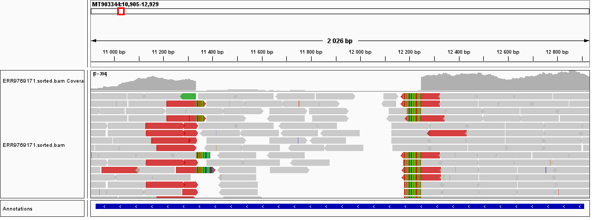

# MBCB - Genetic Alterations and Functional Impact

For this session, we will analyse some data from the 2022 mpox (formerly known as Monkeypox) outbreak in Portugal.

We will start with data from the [first cases](https://doi.org/10.1038/s41591-022-01907-y) in early May 2022.

Briefly, total DNA was extracted from the clinical sample, and shotgun metagenomics sequencing was performed (more details available in the paper). Reads were human-depleted using BMTagger and subsequently mapped to the reference genome [MPXV-UK_P2 MT903344.1](https://www.ncbi.nlm.nih.gov/nuccore/MT903344.1).

We are going to analyse data from the sample [Monkeypox/PT0005/2022](https://www.ncbi.nlm.nih.gov/nuccore/ON585037.1). Due to ethical reasons, only the reads mapping to the monkeypox virus reference are submitted to public repositories, and that is what we will use in our analysis.

We first need to map the raw sequencing files to the reference genome. As you saw in the previous session, for this, we need the fastq files of our sample, as well as the fasta file of the reference genome. Then, we will use bwa to align the reads and samtools to transform the SAM file that is the output of bwa into a sorted, indexed, BAM file that will be used for further analysis.

**TASK**: Download the fasta file of the reference from https://www.ncbi.nlm.nih.gov/nuccore/MT903344.1 
<details><summary>Click Here to see a hint</summary><p>  
  Click on: Send to > File > Format (FASTA) > Create File 
</p></details>
<br/>

As in the last session, we will make use of [docker](https://www.docker.com/) images to facilitate reproducible installation of different bioinformatic tools in (almost) any environment. The following tasks assume the environment you are working in has already docker installed and ready to use.

 **TASK**: Download the paired fastq files using sra-tools fasterq-dump with the repository id ERR9769171  
<details><summary>Click Here to see a hint</summary><p>  

  If you have not done so before, pull a docker image for sra-tools eg.:
```
docker pull ncbi/sra-tools:3.0.1
```

Next, run fasterq-dump using the sra-tools docker image:
```
docker run --rm -v $PWD:/data ncbi/sra-tools:3.0.1 fasterq-dump --outdir /data ERR9769171
```

Since these reads are already the reads that map to the monkeypox genome, they have been already quality processed, and thus can be used directly as they are for subsequent analyses.

</p></details>
<br/>


**TASK**: Generate an indexed BAM file with the alignments of the monkeypox sample reads against the MT903344.1 reference
<details><summary>Click Here to see a hint</summary><p>

If you have not done so before, pull a docker image for bwa and samtools eg.:
```
docker pull biocontainers/bwa:v0.7.17-3-deb_cv1
docker pull biocontainers/samtools:v1.9-4-deb_cv1
```

We first need to create an index of the reference genome to be able to use bwa to align the reads against the reference. 
```
docker run --rm -v $PWD:/data biocontainers/bwa:v0.7.17-3-deb_cv1 bwa index MT903344.1.fasta
```

Next we use bwa to generate alignments:
```
docker run --rm -v $PWD:/data biocontainers/bwa:v0.7.17-3-deb_cv1 bwa mem MT903344.1.fasta ERR9769171_1.fastq ERR9769171_2.fastq > ERR9769171.sam 
```

Finally, we use samtools to convert the sam to bam, sort it by position, and index it.

```
docker run --rm -v $PWD:/data biocontainers/samtools:v1.9-4-deb_cv1 samtools view -Sb ERR9769171.sam > ERR9769171.bam
docker run --rm -v $PWD:/data biocontainers/samtools:v1.9-4-deb_cv1 samtools sort -o ERR9769171.sorted.bam ERR9769171.bam
docker run --rm -v $PWD:/data biocontainers/samtools:v1.9-4-deb_cv1 samtools index ERR9769171.sorted.bam
```

Note: you should now also have the file ERR9769171.sorted.bam.bai

</p></details>
<br/>

Now that we obtained our alignments, let's try to obtain variants, ie., differences from the reference. For this we will use [freebayes](https://github.com/freebayes/freebayes), a tool that is relatively simple to use, and has been used in several different contexts. Note that there are several programs to perform variant calling, and with varying performance in different situations. 

Let's pull a docker image for freebayes (note that this is not the most recent version):
```
docker pull biocontainers/freebayes:v1.2.0-2-deb_cv1
```

We will start by looking at the available options to run the software
```
docker run --rm biocontainers/freebayes:v1.2.0-2-deb_cv1 freebayes -h
```

As you can see, freebayes has several options, although it can be used even without explicitly providing any of them. One important parameter is ploidy, as it determines how many possible haplotypes we should expect to have at a given locus. 

**Question**: Knowing that this is a virus, do you think using the default ploidy of 2 is a good idea?
<details><summary>Click Here to see a suggestion</summary><p>

Assuming a simple exponential expansion of the virus, the most likely ploidy is 1. Nonetheless, if we want try to uncover the presence of other clones, we may need to change the ploidy value. 

</p></details>
<br/>

Other parameters include quality filters for the base quality and alignment quality that influence the variant calling process. Freebayes provide a parameter -0 that provides a strict threshold for these quality parameters.

**TASK**: Run the following freebayes command:
```
docker run --rm -v $PWD:/data biocontainers/freebayes:v1.2.0-2-deb_cv1 freebayes -p 1 -0 -f MT903344.1.fasta ERR9769171.sorted.bam > ERR9769171.sorted.vcf
```

**Question**: How many variants are in the VCF file?
<details><summary>Click Here to see a suggestion</summary><p>

The VCF contains 60 variants (the number of lines, except the header lines starting with '#'). Note that by default, freebayes reports every position where there is any kind of evidence (no matter how small) of differences with the reference. 

</p></details>
<br/>

**Question**: How many variants are in the VCF file with good quality (QUAL>30)?
<details><summary>Click Here to see a suggestion</summary><p>

The VCF contains 40 variants with QUAL>30, 39 SNPs and one tandem repeat.

</p></details>
<br/>

**Question**: Does the VCF contain all the SNVs described in the [paper (see Fig.2)](https://www.nature.com/articles/s41591-022-01907-y/figures/2)? If not, can you think of a reason why that is so?
<details><summary>Click Here to see a suggestion</summary><p>

All SNVs in Fig.2 of the paper are in the VCF except the first 5 and the last 5. These SNVs fall inside the terminal repeat region, a duplicated area present at the ends of the genome. Since there is more than one exact copy of it, the mapping quality of reads aligning to this region is 0, and are excluded from analysis (in accordance with the parameters we used).

</p></details>
<br/>

**Question**: Do you see any pattern in the detected SNVs?
<details><summary>Click Here to see a suggestion</summary><p>

The vast majority of SNVs are G>A or C>T mutations. This is thought to be the sign of interaction with the host (human) immune system, namely through the [APOBEC deaminase](https://www.science.org/doi/10.1126/science.adg8116).  

</p></details>
<br/>


Freebayes only detects mutations that fall within the read (SNVs and small indels). Sice the type of evidence necessary to detect larger structural variants is different, specific tools are necessary. We will use one easy to use tool that was developed to study experimental evolution of E. coli. This tool, [breseq](https://barricklab.org/twiki/bin/view/Lab/ToolsBacterialGenomeResequencing), performs all the necessary steps to detect variants, including structural variants, and produces a nice report with all the information.    

Before trying to use it for our sample, let's explore an example output. Namely, we will look at Example1a from the breseq introductory topics workshop.

**TASK**: Open the [link for the example](https://barricklab.org/twiki/pub/Lab/ToolsBacterialGenomeResequencing/IntroWorkshop/REL11392_Ara+1_50K_clone_A/).

You should now see several predicted mutations, including the type of evidence breseq used to predict it. For SNVs, and several of the small indels, the evidence used is RA (read alignment). For structural variants, including movement of transposons (like the bacterial IS - insertion sequence elements), the evidence include JC (new junctions - connections of regions of the reference previously unconnected) and MC (missing coverage - regions of the genome with no alignments).

**TASK**: Click on the MC and JC evidence for the large deletion in the position 547,700

For the large deletion in position 547,700, you can see that there are very few unique read alignments within the region (missing coverage), and there are several reads that span the genomic positions that were previously unconnected (new junctions). 

**Note**: At the bottom of the report, there are positions with junction or missing coverage evidence suggesting differences from the reference (mostly structural variants), but that do not pass the strict criteria breseq uses for calling a variant. 

Let's now try to use breseq with our monkeypox sample. First, let's obtain the software.

**TASK**: Pull a docker image for breseq:
```
docker pull jysgro/breseq:ub2304_py3114_R422_br0381_bt245
```

**TASK**: See the available parameters for breseq.
```
docker run --rm jysgro/breseq:ub2304_py3114_R422_br0381_bt245 breseq -h
```

As you can see, there are many parameters available. The simplest mandatory parameters are the reference, and the fastq reads. Notice that the reference breseq prefers is not in the fasta format, but in the genbank (.gbk) format. This is because breseq also performs variant annotations, ie. tries to predict the effect of the variant, and thus it requires gene annotations, which are included in the genbank format.


**TASK**: Download the genbank file (full) of the reference from https://www.ncbi.nlm.nih.gov/nuccore/MT903344.1 

Click on: Send to > File > Format (Genbank - Full) > Create File 

The genbank format usually only includes the annotations, but here we also want to include the genome sequence, so we need to obtain the genbank (full) format.

**TASK**: Run breseq on the monkeypox sample
```
docker run --rm -v $PWD:/data jysgro/breseq:ub2304_py3114_R422_br0381_bt245 breseq -n ERR9769171 -o ERR9769171_breseq -r MT903344.1.gb ERR9769171_1.fastq ERR9769171_2.fastq
```

This will take a few minutes to run, depending on your computer. 

**TASK**: Open the output report in ERR9769171_breseq/output/index.html

**Question**: How do the variants that breseq reports compare with what you obtained with freebayes?
<details><summary>Click Here to see a suggestion</summary><p>

All SNVs are the same. The indel at position is annotated slightly differently, and two more indels are reported by breseq.

</p></details>
<br/>


**Question**: Is there any evidence for larger structural variants?
<details><summary>Click Here to see a suggestion</summary><p>

There are no large structural variants that pass the strict threshold of breseq.

Nonetheless, there is unassigned evidence that we could look at. Namely, there is evidence for the junction between positions 11334 and 12248 at 97.4% (meaning, of all reads spanning the region, almost all support the junction). Moreover, although there is complete missing coverage in the region, there is missing coverage evidence within the region. This strongly suggests a deletion event at or near position 11334 until near position 12248 (914bp).

Looking at the alignments in IGV, we can confirm this:


There is also some apparent missing coverage evidence at the beginning and the end of the genome, but this because these are the repeated terminal regions, and thus is it natural that no unique alignments can be found here. 

Junction evidence at or near position 133090 is close to a polyA repetitive locus, with arefactual alignments (eg. reads from the host bearing a polyA repeat), and thus it is unlikely to be a real structural variant. 

Finally, a missing coverage evidence at position 173314 may suggest some incoherence between the sample genome and the reference genome, but the specific variant is not obvious and would require further specific investigation.

</p></details>
<br/>

Sequencing virus using shotgun metagenomics is very expensive, as usually less than 1% is viral genome. Therefore, like for SARS-CoV-2, an amplicon set covering the whole monkeypox genome [was generated](https://doi.org/10.1371/journal.pbio.3002151), enabling a much faster and cheaper sequencing of samples. With this new tool in hand, we could sequence over 50% of all the detected cases in Portugal, [revealing the complexity of the explosive monkeypox outbreak in 2022](https://doi.org/10.1038/s41591-023-02542-x).

Let's now look at one the samples obtained during the 2022 outbreak sequenced using the amplicon set from [Chen et al.](https://doi.org/10.1371/journal.pbio.3002151). 

**TASK**: Generate a VCF file with variants, obtained using freebayes, for sample [Monkeypox/PT0428/2022](https://www.ncbi.nlm.nih.gov/nuccore/OP555515.1), with id ERR10513231
<details><summary>Click Here to see a suggestion</summary><p>

```
docker run --rm -v $PWD:/data ncbi/sra-tools:3.0.1 fasterq-dump --outdir /data ERR10513231
docker run --rm -v $PWD:/data biocontainers/bwa:v0.7.17-3-deb_cv1 bwa mem MT903344.1.fasta ERR10513231_1.fastq ERR10513231_2.fastq > ERR10513231.sam
docker run --rm -v $PWD:/data biocontainers/samtools:v1.9-4-deb_cv1 samtools view -Sb ERR10513231.sam > ERR10513231.bam
docker run --rm -v $PWD:/data biocontainers/samtools:v1.9-4-deb_cv1 samtools sort -o ERR10513231.sorted.bam ERR10513231.bam
docker run --rm -v $PWD:/data biocontainers/samtools:v1.9-4-deb_cv1 samtools index ERR10513231.sorted.bam
docker run --rm -v $PWD:/data biocontainers/freebayes:v1.2.0-2-deb_cv1 freebayes -p 1 -0 -f MT903344.1.fasta ERR10513231.sorted.bam > ERR10513231.sorted.vcf
```

</p></details>
<br/>

**Question**: 
<details><summary>Click Here to see a suggestion</summary><p>


</p></details>
<br/>


It has a deletion at NC_063383:11,326-12,238

breseq -r NC_063383.1.gb -j 4 -n ERR9769171 -o ERR9769171_breseq ERR9769171_1.fastq.gz ERR9769171_2.fastq.gz


Routine surveillance of monkeypox 

[amplicon sequencing]

PT428 (A2.3): ERR10513231
fasterq-dump ERR10513231


PT400 (B.1): ERR10513212
fasterq-dump ERR10513212


Suggestions to try if you have the time and interest:

Paper explaining how breseq detects structural variants: https://pubmed.ncbi.nlm.nih.gov/25432719/

Using breseq, find variants from an Ecoli sample from the paper
https://journals.plos.org/plosgenetics/article?id=10.1371/journal.pgen.1004182. 

Namely, use the sample SRR625891 and the reference NC_000913.3

• How many variants do you detect, in which genes? What types of variants do you detect?

[ 16 variants: 5 SNVs; 4 indels; 4 deletions; 3 other structural variants ]
